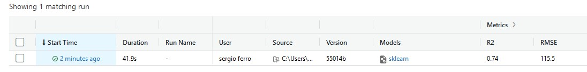
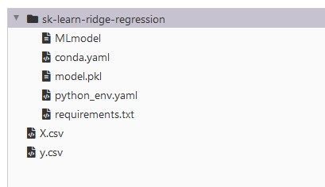
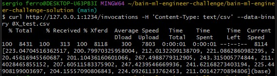
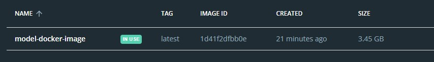
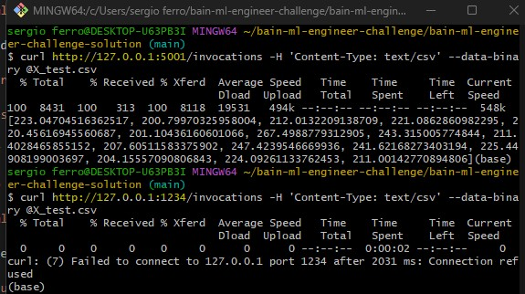

# Good day!

The contents on this repository circumscribe the following:

- A pre-processing and training pipeline that outputs a .pkl file (i.e. the serialized model). 
- An API that takes the serialized model and exposes an endpoint to get predictions.

I used MLFlow for the solution, it is open source software that can be tested locally and it is cloud-provider agnostic. 

## What you will need

To run this pipeline and get advantage of all its functionalities you will need:

- Anaconda, with path variables correctly set up (https://www.geeksforgeeks.org/how-to-setup-anaconda-path-to-environment-variable/)
- ML Flow (`pip install mlflow`).
- scikit-learn, comes with Anaconda but you can always install the latest version using 
`pip install -U scikit-learn`
- I use git bash, but any shell with git will do the work.
- to clone this repository into a local folder 
`git clone https://github.com/smferro54/bain-ml-engineer-challenge.git`

## Running the model

Open your preferred CLI (I use git bash) and type the following commands:

`cd bain-ml-engineer-challenge/bain-ml-engineer-challenge-solution`

`conda init`

`mlflow run .`

You should get a model ID when the run succeeds.

You can check the results in the web UI. 

`mlflow ui`

and view it at [localhost:5000](http://localhost:5000/)

## Getting predictions from the model

To deploy a local (port 1234) REST server that can serve predictions use a new CLI window to type:

`mlflow models serve -m ./mlruns/0/<YOUR MODEL ID>/artifacts/sk-learn-ridge-regression -p 1234`

Make sure your model ID matches one of the names under the ./mlruns/0/ folder.

The training stage saves the test data from training in a .csv file called X_test.csv. This will come in handy now, please type the following in a new CLI window:

`curl http://127.0.0.1:1234/invocations -H 'Content-Type: text/csv' --data-binary @X_test.csv`

This should give the following predictions:

[We could also use a json file for web based applications](https://mlflow.org/docs/latest/models.html#local-model-deployment). 

## Containerizing the model 

For the final step, the service can be containerized typing the following:

`mlflow models build-docker -m ./mlruns/0/<YOUR MODEL ID>/artifacts/sk-learn-ridge-regression -n model-docker-image --enable-mlserver`

By the time I wrote this document I was getting a UnicodeDecodeError, but nonetheless the image was in my repository:

We can now initialize the server from the image using:

`docker run -p 5001:8080 "model-docker-image"`

And check that the server is returning predictions. We can use the same command as before in a new CLI window we can open from our bain-ml-engineer-challenge-solution folder, using the new 5001 port:

`curl http://127.0.0.1:5001/invocations -H 'Content-Type: text/csv' --data-binary @X_test.csv`

We can check that we're getting the predictions from the docker container (our former 1234 server is already disconnected):

I've tried and tested this steps in a new cloned repository in my local machine and they work perfectly. That said, feel free to report any issues. 

Best,

Sergio
