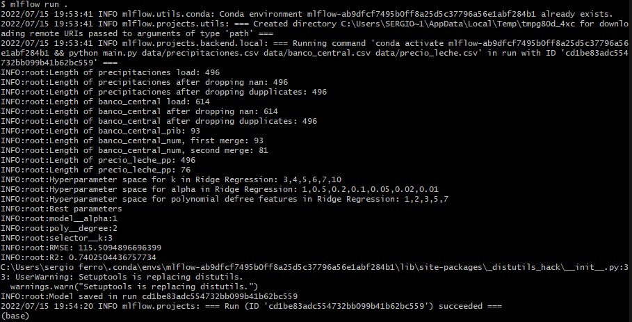
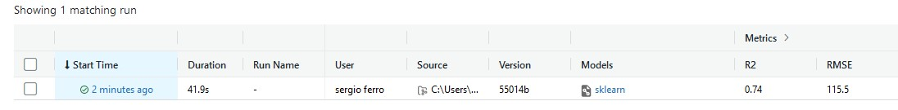
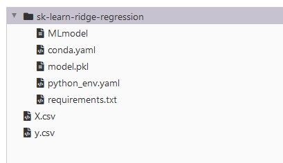

# Good day!

The contents on this repository circumscribe the following:

- A pre-processing and training pipeline that outputs a .pkl file (i.e. the serialized model). 
- An API that takes the serialized model and exposes an endpoint to get predictions.

I used MLFlow for the solution, it is open source software that can be tested locally and is cloud-provider agnostic. 

## What you will need

To run this pipeline and get advantage of all its functionalities you will need:

- Anaconda, with path variables correctly set up (https://www.geeksforgeeks.org/how-to-setup-anaconda-path-to-environment-variable/)
- ML Flow (`pip install mlflow`).
- scikit-learn, comes with Anaconda but you can always install the latest version using 
`pip install -U scikit-learn`
- I use git bash, but any shell with git will do the work.
- to clone this repository into a local folder 
`git clone https://github.com/smferro54/bain-ml-engineer-challenge.git`

## Running the model

Open your preferred CLI (I use git bash) and type the following commands:

`cd bain-ml-engineer-challenge_solution`

`conda init`

`mlflow run .`

You should get a model ID when the run succeeds.

You can check the results in the web UI. 

`mlflow ui`

and view it at [localhost:5000](http://localhost:5000/)

Best,

Sergio
